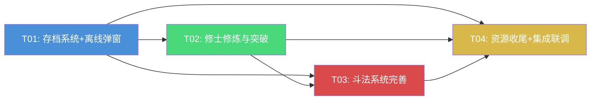

# Phase 0+1 增量架构设计 + 任务分解

> 项目: 修仙放置 RPG (Godot 4 + GDScript)
> 路径: `D:\01GAME\DEMO1\`
> 阶段: PRD Phase 0 收尾 + Phase 1 核心
> 目标: 跑通"修炼→斗法→获资源→修炼"核心循环，达成 M1 里程碑

---

## Part A: 系统设计

### 1. 实现方案

#### 1.1 现有代码分析总结

| 模块 | 现状 | 缺口 |
|------|------|------|
| **EconomyManager** | 已有 spirit_stones/jade/exp/dust 四种资源 + fragments 碎片系统，_persist() 已保存 | 缺少 `spend_dust()` 便捷方法；home.gd 资源栏未显示 dust/fragments |
| **SaveManager** | 有 save/load/get_data/set_data/mark_dirty，60s 自动存档，_exit_tree 存档，APPLICATION_PAUSED 存档 | **关键 Bug**: `last_save_time` 存在 `_save_data` 根级，但 main.gd 从 `get_data("player")` 读取 → 离线收益永远算 0；自动存档间隔应为 30s；缺少关键操作后即时存档 |
| **HeroManager** | 有 level_up()（消耗灵石）、quality_up()（消耗 dust+fragments）、get_hero_stats() | level_up 未消耗修为(exp)；quality_up 成本硬编码未读 balance.json；缺少 can_level_up/can_quality_up/get_xxx_cost 公开方法供 UI 查询；未限制 max_level |
| **BattleManager** | 有同步 while 循环战斗、伤害计算(暴击+克制)、自动绝学触发 | **能量永远为 0**（无能量获取逻辑）→ 绝学永不触发；战斗同步执行 → UI 只能看到最终状态；无手动绝学按钮；无加速控制；_build_enemy_formation 未用 StageManager 早期保护；奖励未含碎片/灵尘 |
| **IdleSystem** | 有 calculate_offline_rewards()、collect_offline_rewards()、在线积累+静态变量持久化 | 离线收益在 main.gd 中自动领取无弹窗；last_save_time 读取 Bug 导致离线收益失效 |
| **hero_detail** | 仅占位（"开发中"文字+返回按钮） | 全部需要实现 |
| **battle.gd** | 信号已连接，Label 显示单位 HP，结果面板 | 无绝学按钮、无加速、无 HP 进度条；战斗瞬间完成无过程展示 |

#### 1.2 各需求实现策略

**P0-09 资源经济系统（收尾）**
- EconomyManager 已基本完成，仅需补充 `spend_dust()` 便捷方法和确保资源显示完整
- 修改 home.gd 资源栏显示全部 5 种资源（灵石/仙玉/修为/灵尘/碎片总数）

**P0-07 存档系统**
- **修复 last_save_time Bug**: 将 `last_save_time` 移入 `player` 存档段，main.gd 从 `get_data("player")` 正确读取
- **自动存档间隔**: `AUTO_SAVE_INTERVAL` 从 60s 改为 30s
- **关键操作即时存档**: 新增 `SaveManager.save_now()` 公开方法（mark_dirty + 立即 save_game），在 level_up/quality_up/battle_ended/gacha_pull 后调用
- **离线时间戳**: save_game() 时更新 player.last_save_time；load_game() 后保留该值供 IdleSystem 计算

**P0-04 修士修炼与突破**
- **HeroManager.level_up()**: 增加修为(exp)消耗，从 balance.json 读取 hero_level 配置（cost_base/cost_exponent），限制 max_level=240
- **HeroManager.quality_up()**: 从 balance.json 的 quality.dust_cost_per_tier / fragment_cost_per_tier 数组读取成本（替代硬编码）
- **新增公开方法**: `can_level_up()`, `can_quality_up()`, `get_level_up_cost()`, `get_quality_up_cost()`, `get_quality_up_dust_cost()`, `get_quality_up_fragment_cost()` 供 UI 查询
- **hero_detail 场景**: 完整实现修士详情界面（属性展示 + 升级按钮 + 升品质按钮 + 碎片显示 + 阵容切换）
- **hero_list 场景**: 点击修士条目进入 hero_detail

**P0-01 闭关收益（离线结算）**
- **修复 last_save_time 读取**: 配合存档系统修复
- **离线收益弹窗**: 新建 `offline_reward_popup.gd+tscn`，游戏启动时如果有离线收益则弹出弹窗显示离线时长+收益，玩家点击"领取"后才入账
- **main.gd 改造**: 不再自动 collect，改为创建弹窗实例，等待玩家领取

**P0-02 斗法系统**
- **异步战斗**: 将 BattleManager._run_battle() 的同步 while 循环改为 `await` + Timer 的异步回合制，每回合间有延迟（受速度倍率控制）
- **能量系统**: 每次攻击获得 25 能量，能量满 100 时绝学按钮可用
- **手动绝学**: battle.gd 增加绝学按钮，玩家点击触发当前能量满的修士释放绝学（1.5x 伤害）；若不手动触发，回合结束时自动释放
- **加速控制**: battle.gd 增加 1x/1.5x/2x 速度切换按钮，控制回合间延迟（1x=1.0s, 1.5x=0.67s, 2x=0.5s）
- **HP 进度条**: 用 ProgressBar 替代纯文字 HP 显示
- **敌人构建修复**: _build_enemy_formation 使用 StageManager.get_stage_enemy_stats() 应用早期保护
- **奖励完善**: 从 stages.json 的 rewards 读取奖励，额外加入碎片掉落

#### 1.3 关键技术决策

| 决策点 | 选择 | 理由 |
|--------|------|------|
| 战斗执行模式 | 异步回合制（await + Timer） | 需要展示战斗过程、支持手动绝学和加速控制；同步循环无法实现 |
| 绝学触发 | 能量满 100 后手动优先、回合末自动 | 兼顾策略性和放置游戏自动化需求 |
| 离线收益弹窗 | 独立场景组件（Control + AcceptDialog 风格） | 解耦，可复用；不阻塞游戏初始化 |
| 存档时间戳 | 存入 player 段 | 与 main.gd 读取路径一致；语义清晰 |
| 升级成本来源 | balance.json 配置驱动 | 数值可调，不硬编码 |

---

### 2. 文件列表

#### 2.1 需修改的现有文件

| 文件路径 | 修改内容 |
|----------|----------|
| `scripts/autoload/save_manager.gd` | 30s 间隔；last_save_time 移入 player 段；新增 save_now() |
| `scripts/autoload/hero_manager.gd` | level_up 加 exp 消耗 + max_level 限制；quality_up 读 balance.json；新增 6 个查询方法 |
| `scripts/autoload/battle_manager.gd` | 异步战斗循环；能量系统；绝学系统；速度倍率；修复敌人构建；完善奖励 |
| `scripts/autoload/economy_manager.gd` | 新增 spend_dust() 便捷方法 |
| `scripts/autoload/stage_manager.gd` | 新增 get_stage_rewards() 公开方法 |
| `scripts/systems/idle_system.gd` | 无需修改（last_save_time 修复在 save_manager + main 侧） |
| `scenes/main/main.gd` | 修复离线时间戳读取；改为弹窗显示离线收益 |
| `scenes/home/home.gd` | 资源栏显示 5 种资源；碎片总数显示 |
| `scenes/hero/hero_detail.gd` | 完整重写：属性展示 + 升级 + 升品质 + 阵容切换 |
| `scenes/hero/hero_detail.tscn` | 完整重写场景节点结构 |
| `scenes/hero/hero_list.gd` | 修士条目改为 Button 可点击进入详情 |
| `scenes/battle/battle.gd` | 绝学按钮 + 速度切换 + HP 进度条 + 异步显示 |
| `scenes/battle/battle.tscn` | 新增绝学按钮/速度按钮/ProgressBar 节点 |
| `scenes/stage/stage_map.gd` | 显示阵容战力预览 |

#### 2.2 需新建的文件

| 文件路径 | 用途 |
|----------|------|
| `scenes/ui/offline_reward_popup.gd` | 离线收益弹窗逻辑 |
| `scenes/ui/offline_reward_popup.tscn` | 离线收益弹窗场景 |

---

### 3. 数据结构和接口

#### 3.1 类图

> 完整类图见 `docs/class-diagram.mermaid`

核心变更摘要：

**SaveManager 新增/修改**
```gdscript
# 修改: 自动存档间隔
const AUTO_SAVE_INTERVAL: float = 30.0  # 60→30

# 修改: last_save_time 移入 player 段
# _get_default_save_data() 的 player 字典中增加 "last_save_time"

# 新增: 关键操作即时存档
func save_now() -> void  # mark_dirty() + save_game() 立即执行

# 修改: save_game() 写入 player.last_save_time
```

**HeroManager 新增/修改**
```gdscript
# 修改: level_up 增加 exp 消耗 + max_level 限制
func level_up(hero_id: String) -> bool  # 消耗 spirit_stones + exp

# 修改: quality_up 从 balance.json 读取成本
func quality_up(hero_id: String) -> bool

# 新增: UI 查询方法
func can_level_up(hero_id: String) -> bool
func can_quality_up(hero_id: String) -> bool
func get_level_up_cost(hero_id: String) -> Dictionary  # {spirit_stones, exp}
func get_quality_up_cost(hero_id: String) -> Dictionary  # {dust, fragments}
func get_max_level() -> int  # 240
```

**BattleManager 新增/修改**
```gdscript
# 修改: 异步战斗
func _run_battle() -> void  # 改为 async, await Timer
func set_speed_multiplier(mult: float) -> void  # 1.0/1.5/2.0

# 新增: 手动绝学
func can_use_skill(hero_id: String) -> bool
func use_skill(hero_id: String) -> void  # 手动触发绝学

# 修改: 能量系统
# _attack() 中 energy += 25, 满 100 可释放绝学

# 新增信号
signal skill_ready(hero_id: String)  # 能量满时通知 UI
signal round_started(round: int)
```

**StageManager 新增**
```gdscript
func get_stage_rewards(stage_id: int) -> Dictionary  # 从 stages.json 读取 rewards
```

**EconomyManager 新增**
```gdscript
func spend_dust(amount: int) -> bool  # 便捷方法
func get_total_fragments() -> int  # 碎片总种类数（用于 UI 显示）
```

**OfflineRewardPopup（新类）**
```gdscript
class_name OfflineRewardPopup
extends Control

signal rewards_collected(rewards: Dictionary)

func setup(rewards: Dictionary) -> void  # 传入离线收益数据
func _on_collect_pressed() -> void  # 领取按钮回调
```

#### 3.2 关键数据流

**离线收益流程（修复后）**
```
游戏启动 → SaveManager.load_game() → 读取 player.last_save_time
→ main.gd 创建 IdleSystem → calculate_offline_rewards(last_save_time)
→ rewards 非空 → 创建 OfflineRewardPopup → 显示弹窗
→ 玩家点击领取 → collect_offline_rewards() → EconomyManager.add()
→ 弹窗关闭 → 切换到 Home 场景
```

**修士升级流程**
```
hero_detail.gd 点击升级 → HeroManager.can_level_up(hero_id) 检查
→ true → HeroManager.level_up(hero_id)
  → EconomyManager.spend(spirit_stones, cost)
  → EconomyManager.spend(exp, cost)
  → _hero_levels[hero_id] += 1
  → hero_leveled_up 信号
  → SaveManager.save_now()
→ hero_detail.gd 监听信号 → 刷新 UI
```

**异步战斗流程**
```
stage_map.gd 点击斗法 → GameManager.go_battle()
→ battle.gd._ready() → BattleManager.start_battle(formation, stage_id)
  → _build_formation() (含能量=0)
  → _build_enemy_formation() (用 StageManager 早期保护)
  → battle_started 信号
  → _run_battle() (async):
    while IN_PROGRESS:
      await Timer(回合延迟 / 速度倍率)
      round_started 信号 → battle.gd 刷新显示
      按速度排序，逐单位 _attack()
        → energy += 25
        → 能量≥100 → skill_ready 信号 → battle.gd 点亮绝学按钮
      检查胜负 → _end_battle()
→ battle_ended 信号 → battle.gd 显示结果面板 → SaveManager.save_now()
```

---

### 4. 程序调用流程

> 完整时序图见 `docs/sequence-diagram.mermaid`

#### 4.1 离线收益领取时序

```
Main._ready()
  → SaveManager.load_game()  [读取存档，player.last_save_time]
  → IdleSystem.calculate_offline_rewards(last_save_time)  [计算离线收益]
  → rewards 非空?
    → Yes → OfflineRewardPopup.setup(rewards)  [弹窗显示]
    → 玩家点击领取 → IdleSystem.collect_offline_rewards(rewards)
      → EconomyManager.add_spirit_stones() + add_exp()
    → 弹窗关闭 → GameManager.change_scene(HOME)
    → No → 直接 GameManager.change_scene(HOME)
```

#### 4.2 修士升级时序

```
HeroDetail._on_level_up_pressed()
  → HeroManager.can_level_up(hero_id)  [检查等级+资源]
  → true → HeroManager.level_up(hero_id)
    → EconomyManager.spend(spirit_stones, cost_stones)
    → EconomyManager.spend(exp, cost_exp)
    → _hero_levels[hero_id] += 1
    → hero_leveled_up.emit(hero_id, new_level)
    → SaveManager.save_now()
  → HeroDetail._on_hero_leveled_up()  [刷新属性+按钮状态]
```

#### 4.3 异步战斗时序

```
Battle._ready()
  → BattleManager.start_battle(formation, stage_id)
    → _build_formation() + _build_enemy_formation()
    → battle_started.emit()
    → _run_battle() [async]
      ├─ Loop:
      │  await get_tree().create_timer(delay / speed_mult).timeout
      │  round_started.emit(round)
      │  → Battle._on_round_started() [刷新HP条]
      │  按速度排序逐单位攻击:
      │    _attack(unit) → energy += 25
      │    hero_attacked.emit() → Battle._on_hero_attacked() [更新日志]
      │    if energy >= 100: skill_ready.emit(hero_id)
      │  回合末: 自动释放待发绝学
      │  检查胜负
      └─ _end_battle(victory)
        → _calculate_rewards() [从 stages.json 读取]
        → _apply_rewards() [灵石+修为+碎片]
        → battle_ended.emit(victory, rewards)
  → Battle._on_battle_ended() [显示结果面板]
  → StageManager.clear_stage() / fail_stage()
  → SaveManager.save_now()
```

---

### 5. 待明确事项

| 编号 | 问题 | 当前假设 |
|------|------|----------|
| Q1 | 升级是否同时消耗灵石和修为？PRD 写"消耗灵石+修为"，但 balance.json 只有 `cost_currency: spirit_stones` | 假设同时消耗灵石 + 修为，修为消耗量 = 灵石消耗量 × 0.8（修为主要来源是闭关和战斗） |
| Q2 | 手动绝学是否打断当前回合攻击序列？ | 假设不打断，手动绝学在当前单位攻击时附加额外伤害，或在回合末统一结算 |
| Q3 | 碎片掉落是否所有关卡都掉？ | 假设 Boss 关卡掉落对应势力随机碎片 ×5，普通关卡不掉碎片但掉少量灵尘 |
| Q4 | hero_detail 中阵容切换是否需要拖拽排序？ | MVP 阶段仅支持加入/移除阵容，不支持拖拽排序 |
| Q5 | 战斗失败是否消耗体力或有惩罚？ | 假设无惩罚，可无限重试 |
| Q6 | 在线闭关收益是否受阵容战力影响？ | 当前 balance.json 的 rate 是固定的，假设 MVP 阶段不受战力影响 |

---

## Part B: 任务分解

### 6. 依赖包

本项目使用 Godot 4 内置功能，无需第三方包：

```
- Godot 4.x 内置节点: Control / Timer / ProgressBar / AcceptDialog / VBoxContainer
- 无外部 GDScript 插件/库
- 数据格式: JSON (通过内置 JSON 类解析)
```

### 7. 任务列表（按依赖顺序）

#### T01: 存档系统完善 + 离线收益弹窗

| 字段 | 内容 |
|------|------|
| **Task ID** | T01 |
| **Task Name** | 存档系统完善 + 离线收益弹窗 |
| **Source Files** | `scripts/autoload/save_manager.gd` (修改), `scenes/main/main.gd` (修改), `scenes/ui/offline_reward_popup.gd` (新建), `scenes/ui/offline_reward_popup.tscn` (新建) |
| **Dependencies** | 无（基础设施任务） |
| **Priority** | P0 |

**工作内容**:
1. save_manager.gd: `AUTO_SAVE_INTERVAL` 改 30s；`last_save_time` 移入 player 段；新增 `save_now()` 方法（mark_dirty + 立即 save_game）；save_game() 时更新 player.last_save_time
2. offline_reward_popup.gd+tscn: 弹窗显示离线时长 + 灵石/修为收益 + 领取按钮；信号 `rewards_collected`
3. main.gd: 修复从 `get_data("player")` 读取 `last_save_time`；离线收益改为弹窗显示（不自动领取），等待玩家点击领取后再切场景

#### T02: 修士修炼与突破系统

| 字段 | 内容 |
|------|------|
| **Task ID** | T02 |
| **Task Name** | 修士修炼与突破系统 |
| **Source Files** | `scripts/autoload/hero_manager.gd` (修改), `scenes/hero/hero_detail.gd` (重写), `scenes/hero/hero_detail.tscn` (重写), `scenes/hero/hero_list.gd` (修改) |
| **Dependencies** | T01（依赖 save_now() 方法） |
| **Priority** | P0 |

**工作内容**:
1. hero_manager.gd: level_up() 增加修为消耗 + max_level 限制；quality_up() 从 balance.json 读取成本；新增 `can_level_up()`, `can_quality_up()`, `get_level_up_cost()`, `get_quality_up_cost()`, `get_max_level()` 方法；操作后调用 `SaveManager.save_now()`
2. hero_detail.gd+tscn: 完整修士详情界面 — 头像区(文字占位) + 属性面板(atk/hp/speed/crit) + 升级按钮(显示灵石+修为成本) + 升品质按钮(显示灵尘+碎片成本) + 碎片数量 + 阵容加入/移除按钮 + 返回按钮
3. hero_list.gd: 修士条目改为可点击 Button，点击后 `GameManager.change_scene(HERO_DETAIL)` 并传递 hero_id（通过 HeroManager 设当前选中或 GameManager 传参）

#### T03: 斗法系统完善

| 字段 | 内容 |
|------|------|
| **Task ID** | T03 |
| **Task Name** | 斗法系统完善 |
| **Source Files** | `scripts/autoload/battle_manager.gd` (修改), `scenes/battle/battle.gd` (修改), `scenes/battle/battle.tscn` (修改), `scripts/autoload/stage_manager.gd` (修改) |
| **Dependencies** | T01（依赖 save_now()）、T02（依赖 HeroManager 属性计算修复） |
| **Priority** | P0 |

**工作内容**:
1. battle_manager.gd: `_run_battle()` 改异步（await Timer）；新增能量系统（攻击 +25 能量）；新增 `set_speed_multiplier()`；新增 `can_use_skill()` / `use_skill()` 手动绝学；`_build_enemy_formation()` 使用 `StageManager.get_stage_enemy_stats()`；`_calculate_rewards()` 从 stages.json 读取 + Boss 关掉碎片；新增 `skill_ready` / `round_started` 信号
2. battle.gd: 新增绝学按钮（能量满时点亮）；新增 1x/1.5x/2x 速度切换按钮；HP 显示改用 ProgressBar；异步刷新逻辑
3. battle.tscn: 新增 SkillButton / SpeedButton1x / SpeedButton15x / SpeedButton2x 节点 + HP ProgressBar 模板
4. stage_manager.gd: 新增 `get_stage_rewards(stage_id)` 从 stages.json 读取 rewards

#### T04: 资源系统收尾 + 主界面 + 集成联调

| 字段 | 内容 |
|------|------|
| **Task ID** | T04 |
| **Task Name** | 资源系统收尾 + 主界面 + 集成联调 |
| **Source Files** | `scripts/autoload/economy_manager.gd` (修改), `scenes/home/home.gd` (修改), `scenes/stage/stage_map.gd` (修改), `data/balance.json` (验证/微调) |
| **Dependencies** | T01, T02, T03（全部依赖完成后集成联调） |
| **Priority** | P1 |

**工作内容**:
1. economy_manager.gd: 新增 `spend_dust()` 便捷方法；新增 `get_total_fragment_types()` 统计方法
2. home.gd: 资源栏显示灵石/仙玉/修为/灵尘/碎片种类数；闭关收益面板优化显示
3. stage_map.gd: 显示当前阵容总战力（调用 FormationSystem.calculate_power）；显示推荐战力对比
4. balance.json: 验证 hero_level / quality / battle / idle / stage_rewards 数值配置完整性，按需微调
5. 全链路联调: 修炼(闭关)→升级修士→斗法→获资源→继续修炼，确保核心循环无阻塞

### 8. 共享知识（跨文件约定）

```
## 存档结构约定
- 所有存档数据通过 SaveManager.set_data(section, dict) / get_data(section) 读写
- last_save_time 存储在 player 段: save_data["player"]["last_save_time"]
- 关键操作（升级/突破/战斗结束/抽卡）后调用 SaveManager.save_now() 即时存档
- 自动存档每 30s 执行一次（仅 _is_dirty 时写入）

## 资源类型约定
- 资源用 StringName 标识: &"spirit_stones" / &"jade" / &"exp" / &"dust"
- 碎片用 String hero_id 标识: EconomyManager.get_fragments(hero_id)
- EconomyManager.add() / spend() 统一入口，所有变更触发 resource_changed 信号
- 资源变更后 UI 通过 resource_changed 信号自动刷新

## 修士属性约定
- 属性公式: (base + level × growth) × quality_multiplier
- 品质索引: 0=凡 1=灵 2=玄 3=地 4=天 5=仙
- 品质系数: [1.0, 1.5, 2.2, 3.5, 5.0, 8.0]
- 升级成本: balance.json → hero_level.cost_base × level^cost_exponent (灵石) ，修为成本 = 灵石成本 × 0.8
- 升品质成本: balance.json → quality.dust_cost_per_tier[quality+1] / fragment_cost_per_tier[quality+1]
- 最大等级: 240 (balance.json → hero_level.max_level)

## 战斗约定
- 战斗单位 Dictionary 结构: {id, hp, max_hp, atk, speed, crit_rate, crit_dmg, faction, energy, skill_name, skill_damage_mult, is_player}
- 能量: 初始 0，每次攻击 +25，满 100 可释放绝学
- 绝学伤害: 普通攻击伤害 × skill_damage_mult (默认 1.5)
- 速度倍率: 1x=1.0s/回合, 1.5x=0.67s/回合, 2x=0.5s/回合
- 势力克制: 正道→魔道→妖族→佛门→正道 (×1.25 / ×0.75)
- 早期保护: 1-20 关敌人 HP/ATK 削减 15%
- 最大回合: 15 回合，超时判负

## 场景切换约定
- hero_id 传递: hero_list → hero_detail 通过 GameManager 设置 selected_hero_id（新增属性）
- 战斗结果: BattleManager.battle_ended 信号携带 rewards Dictionary
- 所有场景 _ready() 中调用 set_anchors_preset(PRESET_FULL_RECT) 适配屏幕

## 信号连接约定
- 场景 _ready() 中连接 Manager 信号，_exit_tree() 中断开（防止内存泄漏）
- 战斗信号在 battle.gd._ready() 连接，_on_battle_ended 中断开
```

### 9. 任务依赖图



**依赖说明**:
- T01 是所有任务的基础（save_now() 被后续所有任务依赖）
- T02 依赖 T01（升级操作需要 save_now()）
- T03 依赖 T01 + T02（战斗需要 save_now() + HeroManager 属性修复）
- T04 依赖 T01/T02/T03 全部完成（集成联调需要所有功能就绪）
- T02 和 T03 之间有软依赖（战斗使用修士属性），但可并行开发
