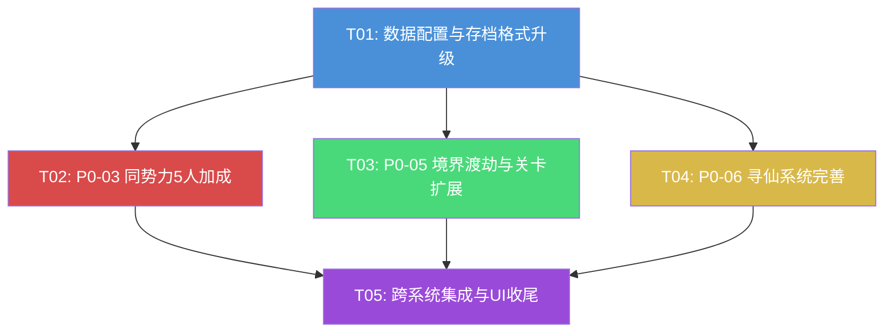

# 《仙途远征》Phase 2 增量架构设计

> 架构师：高见远（Gao）  
> 里程碑：M2 — Phase 2 系统深化  
> 基于 Phase 0+1 已有代码增量设计，保持向前兼容

---

## Part A: System Design

### 1. 实现方案概述

Phase 2 需完成三个 P0 需求的增量完善。以下逐项分析难点与方案。

#### P0-03 四势力克制系统 — 同势力5人加成

**难点**：`BattleManager._build_formation()` 构建战斗单位时直接取 `HeroManager.get_hero_stats()` 的原始属性，未应用同势力加成。`FormationSystem.get_best_faction_bonus()` 虽有加成逻辑，但：① 硬编码 1.25/1.10（未读 `balance.json`）；② 包含 PRD 未要求的 3 人加成（1.10）；③ 仅用于战力计算，不影响实际战斗属性。

**方案**：
- `BattleManager` 新增 `_balance_cache`，在 `_ready()` 加载 `balance.json`
- `_build_formation()` 构建完所有单位后，调用新方法 `_apply_faction_bonus()` 检测同势力 5 人并乘算 atk/hp/max_hp
- `FormationSystem.get_best_faction_bonus()` 改为从 `balance.json` 读取 `same_faction_bonus` 配置，移除 3 人硬编码加成
- 战斗场景 `battle.gd` 显示"同势力加成"提示

#### P0-05 境界推进与渡劫卡关 — 关卡扩展 + 渡劫瓶颈

**难点**：当前仅 10 关，boss 关位置不规律（3,5,7,9,10），无境界/章节名称显示，渡劫关无特殊标记。

**方案**：
- `stages.json` 从 10 关扩展到 20 关，渡劫瓶颈关固定为 4/8/12/16/20（每 4 关一个）
- 每个关卡新增 `realm_name`（境界名）和 `is_tribulation`（渡劫标记）字段
- `StageManager` 新增 `get_realm_name()`、`is_tribulation_stage()`、`get_tribulation_info()` 方法
- 关卡地图 `stage_map.gd` 显示境界名称 + ⚡渡劫标记
- 主界面 `home.gd` 显示当前境界
- 早期保护机制（1-20 关降难 15%）已就绪，无需改动

#### P0-06 寻仙系统 — 心愿单 + 碎片转换 + JSON配置 + 概率公示

**难点**：`GachaManager` 全部使用硬编码常量（概率/消耗/保底），不读 `gacha.json`；`HeroManager.add_hero()` 重复修士硬编码转 10 碎片（应按 rarity 查 `gacha.json.fragment_conversion`）；无心愿单逻辑；`gacha.json` 有键名 typo（`" pity_rules"` 前导空格）；抽卡界面无概率公示。

**方案**：
- `GachaManager._ready()` 加载 `gacha.json`，所有硬编码常量改为从配置读取
- 新增心愿单系统：`set_wishlist()` / `get_wishlist()`，出 SR+ 时 50% 概率出心愿单修士
- 碎片转换移至 `GachaManager`：`_convert_to_fragments()` 按 rarity 查 `fragment_conversion` 配置
- `HeroManager.add_hero()` 简化：仅添加新修士，重复返回 false（不再硬编码转碎片）
- 抽卡界面 `gacha.gd` 新增心愿单选择 UI + 概率公示 + 碎片转换反馈
- 修复 `gacha.json` 键名 typo

---

### 2. 文件列表

#### 需修改的文件（共 15 个）

| # | 文件路径 | 改动类型 | 所属任务 |
|---|---------|---------|---------|
| 1 | `data/stages.json` | 重写（10→20关 + 新字段） | T01 |
| 2 | `data/gacha.json` | 修复 typo + 新增 wishlist 配置 | T01 |
| 3 | `data/balance.json` | 新增 realms 配置段 | T01 |
| 4 | `scripts/autoload/save_manager.gd` | 存档格式升级 v1→v2 | T01 |
| 5 | `scripts/autoload/battle_manager.gd` | 同势力加成 + 读 balance.json | T02 |
| 6 | `scripts/systems/formation_system.gd` | 读 balance.json + 移除3人加成 | T02 |
| 7 | `scenes/battle/battle.gd` | 显示同势力加成提示 | T02 |
| 8 | `scripts/autoload/stage_manager.gd` | 境界/渡劫查询方法 | T03 |
| 9 | `scripts/data/stage_data.gd` | 新增 realm_name/is_tribulation 字段 | T03 |
| 10 | `scenes/stage/stage_map.gd` | 境界名称 + 渡劫标记 | T03 |
| 11 | `scenes/home/home.gd` | 主页显示当前境界 | T03 |
| 12 | `scripts/autoload/gacha_manager.gd` | 读 gacha.json + 心愿单 + 碎片转换 | T04 |
| 13 | `scripts/autoload/hero_manager.gd` | 简化 add_hero() | T04 |
| 14 | `scenes/gacha/gacha.gd` | 心愿单 UI + 概率公示 + 碎片反馈 | T04 |
| 15 | `scripts/data/gacha_data.gd` | 新增 wishlist 配置字段 | T04 |

#### 集成验证涉及文件（T05）

| # | 文件路径 | 改动内容 |
|---|---------|---------|
| 16 | `scenes/ui/top_bar.gd` | 资源栏增加境界显示 |
| 17 | `scenes/battle/battle.gd` | 渡劫关战斗特殊提示（跨T02/T03） |
| 18 | `scenes/gacha/gacha.gd` | 端到端抽卡流程验证（跨T04） |

---

### 3. 数据结构与接口

#### 3.1 类图

详见 `docs/class-diagram-phase2.mermaid`

#### 3.2 关键数据结构变更

##### 存档格式（save_data.json）— v1 → v2

```jsonc
{
  "version": 2,                    // 1 → 2
  "gacha": {
    "total_pulls": 0,
    "pity_counter": 0,
    "wishlist": [],                // 新增：心愿单 ["hero_id1", "hero_id2", "hero_id3"]
    "active_banner": "normal"      // 新增：当前卡池 ID
  },
  // 其余段（player/resources/heroes/stage/settings）不变
}
```

**迁移策略**：`SaveManager._migrate_save()` 中 v1→v2 补全 `gacha.wishlist = []`、`gacha.active_banner = "normal"`。旧存档自动兼容。

##### stages.json — 新增字段

```jsonc
{
  "id": 4,
  "name": "妖狼王",
  "chapter": 1,
  "realm_name": "练气期",         // 新增：境界名称
  "is_tribulation": true,          // 新增：渡劫瓶颈关标记
  "description": "渡劫瓶颈，妖狼王拦路",
  "recommended_power": 850,
  "enemies": [...],
  "rewards": {...},
  "is_boss": true                  // 保留：is_tribulation 的别名，用于奖励逻辑
}
```

渡劫关规则：`is_tribulation = is_boss = (stage_id % 4 == 0)`，即第 4/8/12/16/20 关。

##### gacha.json — 修复 + 新增

```jsonc
{
  "banners": [...],
  "pity_rules": {                  // 修复：原为 " pity_rules"（前导空格）
    "soft_pity_start": 25,
    "hard_pity": 30,
    "pity_rarity_min": 3,
    "pity_reset_on_hit": true
  },
  "fragment_conversion": {"R": 10, "SR": 30, "SSR": 80, "UR": 200},
  "wishlist": {                    // 新增：心愿单配置
    "max_size": 3,
    "min_rarity": 2,               // SR+ 才能加入心愿单
    "probability": 0.5             // 出 SR+ 时 50% 概率出心愿单
  }
}
```

##### balance.json — 新增 realms 配置段

```jsonc
{
  "realms": {                      // 新增：境界配置
    "names": ["练气期", "筑基期", "金丹期", "元婴期", "化神期"],
    "stages_per_realm": 40,
    "tribulation_interval": 4
  },
  "faction_counter": {             // 已有，无变化
    "advantage_multiplier": 1.25,
    "disadvantage_multiplier": 0.75,
    "same_faction_bonus": {"attack": 1.25, "hp": 1.25, "required_count": 5}
  }
}
```

#### 3.3 核心接口定义

##### BattleManager（新增/修改方法）

```gdscript
# 新增状态
var _balance_cache: Dictionary = {}

# 新增：加载 balance.json
func _load_balance_config() -> void

# 修改：_build_formation() 末尾调用
func _apply_faction_bonus(formation: Array[Dictionary]) -> void
  # 检测阵容中同势力 ≥ required_count(5) 的势力
  # 对该势力所有单位乘算 atk_mult / hp_mult（同时更新 max_hp）
  # 读取 balance.json → faction_counter.same_faction_bonus

# 新增：获取同势力加成信息（供 UI 显示）
func get_faction_bonus_info() -> Dictionary
  # 返回 {"active": bool, "faction": String, "atk_mult": float, "hp_mult": float}
```

##### FormationSystem（修改方法）

```gdscript
# 修改：从 balance.json 读取配置，移除 3 人加成
static func get_best_faction_bonus(hero_ids: Array[String]) -> Dictionary
  # 读取 balance.json → faction_counter.same_faction_bonus
  # 仅当同势力 >= required_count(5) 时返回加成
  # 返回 {"attack": float, "hp": float, "faction": String, "count": int}
```

##### StageManager（新增方法）

```gdscript
# 新增：获取境界名称
func get_realm_name(stage_id: int) -> String
  # 从 stage_data 的 realm_name 字段读取，无数据返回 ""

# 新增：是否为渡劫瓶颈关
func is_tribulation_stage(stage_id: int) -> bool
  # 从 stage_data 的 is_tribulation 字段读取

# 新增：获取渡劫关信息（供 UI 提示）
func get_tribulation_info(stage_id: int) -> Dictionary
  # 返回 {"is_tribulation": bool, "name": String, "description": String}

# 新增：获取当前境界进度
func get_realm_progress() -> Dictionary
  # 返回 {"realm_name": String, "current": int, "total": int}
  # current = 当前关卡在当前境界内的序号, total = stages_per_realm
```

##### GachaManager（新增/修改方法）

```gdscript
# 新增状态
var _gacha_config: Dictionary = {}
var _active_banner_id: String = "normal"
var _wishlist: Array[String] = []
var _fragment_conversion: Dictionary = {}

# 新增：加载 gacha.json
func _load_gacha_config() -> void

# 新增：配置 getter（替代硬编码常量）
func get_single_pull_cost() -> int      # 替代 const SINGLE_PULL_COST
func get_ten_pull_cost() -> int         # 替代 const TEN_PULL_COST
func get_pity_threshold() -> int        # 替代 const PITY_THRESHOLD
func get_rates() -> Dictionary          # 替代 const RARITY_*

# 新增：卡池管理
func get_banners() -> Array
func get_active_banner() -> Dictionary
func set_active_banner(banner_id: String) -> void

# 新增：心愿单
func get_wishlist() -> Array[String]
func set_wishlist(hero_ids: Array[String]) -> bool
  # 校验：数量 ≤ max_size(3)，rarity ≥ min_rarity(2)，无重复，hero 存在
func clear_wishlist() -> void

# 新增：碎片转换
func _convert_to_fragments(hero_id: String) -> int
  # 按 rarity 查 fragment_conversion，调用 EconomyManager.add_fragments()
  # 返回转换的碎片数量

# 修改：_do_pull() — 使用配置 + 心愿单 + 碎片转换
# 修改：_roll_rarity() — 从 active banner 的 rates 读取
# 修改：_pick_hero_by_rarity() — 加入心愿单逻辑 + banner 可用英雄池
# 修改：_force_pull_rarity() — 加入碎片转换
# 修改：_load_from_save() / _persist() — 增加 wishlist + active_banner
```

##### HeroManager（修改方法）

```gdscript
# 修改：add_hero() — 移除碎片转换逻辑
func add_hero(hero_id: String) -> bool
  # 新修士：添加并返回 true
  # 已拥有：返回 false（不再自动转碎片，由 GachaManager 处理）
```

---

### 4. 程序调用流程

详见 `docs/sequence-diagram-phase2.mermaid`

#### 4.1 同势力加成战斗流程

```
BattleManager.start_battle()
  → _build_formation(hero_ids, true)
    → HeroManager.get_hero_stats() × 5  // 构建基础单位
    → _apply_faction_bonus(formation)   // 新增：检测同势力5人
      → 读取 balance.json same_faction_bonus
      → 统计 faction 分布
      → 若某势力 >= 5人：atk *= 1.25, hp *= 1.25, max_hp *= 1.25
  → _build_enemy_formation(stage_id)
  → _run_battle()  // 战斗循环（不变）
```

#### 4.2 抽卡 + 心愿单 + 碎片转换流程

```
GachaManager.single_pull()
  → EconomyManager.spend_jade(get_single_pull_cost())
  → _do_pull()
    → _roll_rarity()  // 从 active banner rates 读取
    → 保底检查（pity_threshold from config）
    → _pick_hero_by_rarity(rarity)
      → 若 rarity >= 2(SR+) 且 wishlist 非空 且 randf() < 0.5:
        → 从 wishlist 中筛选同 rarity 修士，随机选一个
      → 否则：从 banner 可用英雄池按 rarity 随机
    → is_new = not HeroManager.is_owned(hero_id)
    → if is_new: HeroManager.add_hero(hero_id)
    → else: _convert_to_fragments(hero_id)  // 按 rarity 转碎片
    → _persist()  // 保存 wishlist + pity + banner
  → pull_completed.emit([result])
```

#### 4.3 渡劫关挑战流程

```
stage_map.gd _ready()
  → StageManager.get_current_stage()
  → StageManager.get_realm_name(stage_id)  // 新增
  → StageManager.is_tribulation_stage(stage_id)  // 新增
  → UI 显示：境界名称 + ⚡渡劫标记（若为渡劫关）

玩家点击斗法 → battle.gd
  → _start_battle()
  → BattleManager.start_battle(formation, stage_id)
  → 战斗胜利 → StageManager.clear_stage(stage_id)
    → 若下一关为渡劫关：stage_unlocked 信号携带渡劫预警信息
```

---

### 5. 待明确事项

| # | 事项 | 当前假设 |
|---|------|---------|
| 1 | 心愿单修士是否限定卡池可用范围？ | 假定不限：心愿单修士即使不在当前 banner 的 available_heroes 中，触发心愿单时仍可获取。若需限定，工程师在 `_pick_hero_by_rarity` 中增加过滤即可。 |
| 2 | 同势力加成是否仅对玩家方生效？ | 假定是：敌方阵容不享受同势力加成（`_apply_faction_bonus` 仅在 `is_player=true` 时调用）。 |
| 3 | 20 关之后（玩家全部通关）如何处理？ | 假定显示"已通关，敬请期待后续境界"，`current_stage` 不再递增。后续 Phase 扩展新境界。 |
| 4 | 心愿单是否跨卡池共享？ | 假定是：心愿单为全局设置，不随 banner 切换而变化。 |
| 5 | `FormationSystem` 是静态类，加载 `balance.json` 每次调用都读文件？ | 假定可接受：`JSONLoader` 内部有缓存机制（Godot ResourceLoader 缓存）。若性能敏感，可改为首次加载后缓存到 static var。 |
| 6 | 3 人同势力加成是否保留？ | 假定移除：PRD 仅提及 5 人 +25%，3 人 +10% 不在需求中。若需保留可作为平衡性调整。 |

---

## Part B: Task Decomposition

### 6. Required Packages

本项目使用 Godot 4 + GDScript，Phase 2 无新增第三方依赖。所有功能通过 GDScript 内置 API 实现。

```
- Godot 4.x: 游戏引擎（已有）
- GDScript: 脚本语言（已有）
- 无新增依赖
```

---

### 7. Task List（按依赖顺序）

#### T01: 数据配置与存档格式升级

**涉及文件**：
- `data/stages.json` — 扩展 10→20 关，渡劫关为 4/8/12/16/20，新增 `realm_name` + `is_tribulation` 字段
- `data/gacha.json` — 修复 `" pity_rules"` typo，新增 `wishlist` 配置段
- `data/balance.json` — 新增 `realms` 配置段（境界名称列表 + 每境界关数 + 渡劫间隔）
- `scripts/autoload/save_manager.gd` — 存档版本 v1→v2，`_get_default_save_data()` 增加 `gacha.wishlist` + `gacha.active_banner`，`_migrate_save()` 增加迁移逻辑

**依赖**：无（基础层，所有后续任务依赖此任务）

**优先级**：P0

**实现要点**：
1. `stages.json`：20 关数据，每 4 关一组（3 普通 + 1 渡劫），难度递增。境界划分：1-12 关"练气期"，13-20 关"筑基期"。保留 `is_boss` 字段（= `is_tribulation`）以兼容 `BattleManager._calculate_rewards()` 的 boss 掉落逻辑。
2. `gacha.json`：`" pity_rules"` → `"pity_rules"`；新增 `"wishlist": {"max_size": 3, "min_rarity": 2, "probability": 0.5}`。
3. `balance.json`：新增 `"realms": {"names": ["练气期", "筑基期", ...], "stages_per_realm": 40, "tribulation_interval": 4}`。
4. `save_manager.gd`：`SAVE_VERSION` 改为 2；默认存档 `gacha` 段增加 `wishlist: []` 和 `active_banner: "normal"`；`_migrate_save()` 中 v1→v2 时用 `.get()` 补全新字段。

---

#### T02: P0-03 同势力5人加成

**涉及文件**：
- `scripts/autoload/battle_manager.gd` — 新增 `_balance_cache`、`_load_balance_config()`、`_apply_faction_bonus()`、`get_faction_bonus_info()`；修改 `_build_formation()` 末尾调用加成
- `scripts/systems/formation_system.gd` — 修改 `get_best_faction_bonus()` 从 `balance.json` 读取配置，移除 3 人加成硬编码
- `scenes/battle/battle.gd` — `_on_battle_started()` 中调用 `get_faction_bonus_info()`，若激活则显示"同势力加成：攻击+25% 生命+25%"提示

**依赖**：T01（balance.json 的 same_faction_bonus 配置）

**优先级**：P0

**实现要点**：
1. `BattleManager._ready()` 中调用 `_load_balance_config()` 加载 `balance.json` 到 `_balance_cache`。
2. `_build_formation()` 末尾：若 `is_player == true`，调用 `_apply_faction_bonus(formation)`。
3. `_apply_faction_bonus()`：读取 `_balance_cache.faction_counter.same_faction_bonus`，统计阵容 faction 分布，找到 ≥ `required_count`(5) 的势力，对该势力所有单位 `atk *= attack_mult`、`hp *= hp_mult`、`max_hp *= hp_mult`。
4. `FormationSystem.get_best_faction_bonus()`：通过 `JSONLoader.load_dict("res://data/balance.json")` 读取配置，仅当同势力 ≥ 5 时返回加成（移除 3 人 1.10 加成分支）。
5. `battle.gd`：在 `_on_battle_started()` 回调中检查 `BattleManager.get_faction_bonus_info()`，若 `active == true` 则在战斗日志显示加成信息。

---

#### T03: P0-05 境界渡劫与关卡扩展

**涉及文件**：
- `scripts/autoload/stage_manager.gd` — 新增 `get_realm_name()`、`is_tribulation_stage()`、`get_tribulation_info()`、`get_realm_progress()`
- `scripts/data/stage_data.gd` — `from_dict()` 增加 `realm_name` 和 `is_tribulation` 字段解析
- `scenes/stage/stage_map.gd` — 标题显示境界名称，关卡列表渡劫关显示 ⚡ 标记和特殊颜色
- `scenes/home/home.gd` — `_stage_label` 显示"境界名 · 第 N 关"

**依赖**：T01（stages.json 扩展 + balance.json realms 配置）

**优先级**：P0

**实现要点**：
1. `StageManager.get_realm_name(stage_id)`：从 `_stage_db[stage_id].realm_name` 读取，无数据返回空字符串。
2. `StageManager.is_tribulation_stage(stage_id)`：从 `_stage_db[stage_id].is_tribulation` 读取（兼容旧数据：若字段缺失则回退到 `is_boss`）。
3. `StageManager.get_tribulation_info(stage_id)`：返回 `{"is_tribulation": bool, "name": String, "description": String}`。
4. `StageManager.get_realm_progress()`：根据当前关卡和 `balance.json.realms.stages_per_realm` 计算进度。
5. `stage_map.gd._update_title()`：显示"【境界名】第 N 关 — 关卡名"，渡劫关追加"⚡渡劫"。
6. `stage_map.gd._populate_stage_list()`：渡劫关用紫/金色高亮 + ⚡ 标记。
7. `home.gd._update_resources()`：`_stage_label` 改为"练气期 · 第 5 关"格式。
8. `StageData.from_dict()`：增加 `realm_name = data.get("realm_name", "")` 和 `is_tribulation = bool(data.get("is_tribulation", data.get("is_boss", false)))`。

---

#### T04: P0-06 寻仙系统完善

**涉及文件**：
- `scripts/autoload/gacha_manager.gd` — 加载 gacha.json，替换硬编码常量为配置 getter，新增心愿单 + 碎片转换 + 卡池管理
- `scripts/autoload/hero_manager.gd` — `add_hero()` 移除碎片转换，重复时返回 false
- `scenes/gacha/gacha.gd` — 心愿单选择 UI + 概率公示 + 碎片转换结果反馈
- `scripts/data/gacha_data.gd` — `from_dict()` 增加 wishlist 配置字段解析

**依赖**：T01（gacha.json 修复 + 新增 wishlist 配置 + save_manager 存档格式）

**优先级**：P0

**实现要点**：
1. `GachaManager._ready()`：调用 `_load_gacha_config()` 加载 `gacha.json`，初始化 `_fragment_conversion` 和 `_active_banner_id`。
2. 移除所有 `const` 硬编码常量（`RARITY_R/SR/SSR/UR`、`SINGLE_PULL_COST`、`TEN_PULL_COST`、`PITY_THRESHOLD`），替换为从 `_active_banner` 读取的 getter 方法。
3. `_do_pull()` 改造：使用 `get_pity_threshold()` 替代 `PITY_THRESHOLD`；调用 `_pick_hero_by_rarity()` 后判断 `is_new`，新修士调 `HeroManager.add_hero()`，重复调 `_convert_to_fragments()`。
4. `_pick_hero_by_rarity(rarity)` 改造：先从 `active_banner.available_heroes` 筛选候选池；若 `rarity >= wishlist.min_rarity` 且 `wishlist` 非空且 `randf() < wishlist.probability`，则从 wishlist 中筛选同 rarity 修士返回。
5. `_convert_to_fragments(hero_id)`：`rarity_name = _rarity_index_to_name(HeroManager.get_hero_rarity(hero_id))`，`count = _fragment_conversion[rarity_name]`，`EconomyManager.add_fragments(hero_id, count)`，返回 count。
6. `_roll_rarity()` 改造：从 `get_rates()` 读取概率（不再用常量）。
7. `set_wishlist(hero_ids)`：校验数量 ≤ `max_size`、每个修士 `rarity >= min_rarity`、无重复、存在于 `heroes.json`。校验通过后赋值并 `_persist()`。
8. `HeroManager.add_hero()`：移除 `EconomyManager.add_fragments(hero_id, 10)` 分支，已拥有时 `return false`。
9. `gacha.gd`：新增心愿单选择面板（3 个槽位，从 SR+ 修士列表中选择）；新增概率公示文本（显示 R/SR/SSR/UR 概率）；`_display_results()` 中重复修士显示"[重复 → 碎片 ×N]"。
10. `gacha.gd._update_info()`：`GachaManager.SINGLE_PULL_COST` → `GachaManager.get_single_pull_cost()`，`TEN_PULL_COST` → `get_ten_pull_cost()`。
11. `GachaData.from_dict()`：增加 `wishlist_config = data.get("wishlist", {})` 解析。

---

#### T05: 跨系统集成与 UI 收尾

**涉及文件**：
- `scenes/ui/top_bar.gd` — `_stage_label` 显示"境界名 · 第 N 关"
- `scenes/battle/battle.gd` — 渡劫关战斗开始时显示"⚡渡劫瓶颈"特殊提示（跨 T02/T03 集成）
- `scenes/gacha/gacha.gd` — 端到端抽卡流程验证：心愿单 → 概率 → 碎片转换 → 存档（跨 T04 集成）

**依赖**：T02、T03、T04

**优先级**：P1

**实现要点**：
1. `top_bar.gd._refresh()`：`_stage_label.text` 改为 `"%s · 第 %d 关" % [StageManager.get_realm_name(current), current]`，无境界名时回退为 `"第 %d 关"`。
2. `battle.gd._on_battle_started()`：检查 `StageManager.is_tribulation_stage(stage_id)`，若为渡劫关在战斗日志显示"⚡ 渡劫瓶颈 — 此关难度提升，谨慎应战！"。
3. 端到端验证：设置心愿单 → 抽卡 → 验证 SR+ 是否有概率出心愿单修士 → 重复修士是否正确转碎片 → 退出重进验证存档。
4. 验证旧存档（v1）加载后心愿单为空、active_banner 为 "normal"、不崩溃。

---

### 8. Shared Knowledge（跨文件约定）

```
# ===== 存档格式 =====
- 存档版本 v2，旧 v1 存档自动迁移（_migrate_save 补全新字段）
- gacha.wishlist: Array[String]，最多 3 个 hero_id，空数组表示未设置
- gacha.active_banner: String，默认 "normal"
- 所有 .get() 读取存档字段时必须提供默认值，确保向前兼容

# ===== 数据驱动原则 =====
- 所有数值在 JSON 配置文件中，不在代码中硬编码
- gacha_manager 读取 gacha.json 的 banners/rates/costs/pity/fragment_conversion/wishlist
- battle_manager 读取 balance.json 的 faction_counter.same_faction_bonus
- formation_system 读取 balance.json 的 faction_counter.same_faction_bonus
- stage_manager 读取 stages.json 的 realm_name/is_tribulation + balance.json 的 realms

# ===== 碎片转换规则 =====
- 重复修士按 rarity 转换为该修士的碎片
- 转换数量：R=10, SR=30, SSR=80, UR=200（从 gacha.json.fragment_conversion 读取）
- 碎片存储在 EconomyManager._fragments[hero_id]
- 碎片转换由 GachaManager 负责（非 HeroManager）

# ===== 同势力加成规则 =====
- 仅玩家方阵容享受同势力加成
- 需 5 人同势力（required_count=5）才触发，无 3 人加成
- 加成：攻击 ×1.25, 生命 ×1.25（从 balance.json 读取）
- 加成在 _build_formation() 中应用到战斗单位（atk/hp/max_hp 同步乘算）

# ===== 渡劫关规则 =====
- 渡劫瓶颈关为第 4/8/12/16/20 关（每 4 关一个）
- is_tribulation = is_boss = true（渡劫关同时也是 boss 关，享受 boss 掉落）
- 1-20 关均享受早期保护（敌人属性 -15%，隐藏 buff）

# ===== 心愿单规则 =====
- 最多 3 个修士，必须为 SR+ (rarity >= 2)
- 出 SR+ 时 50% 概率出心愿单修士（仅当心愿单中有同 rarity 修士时）
- 心愿单为全局设置，跨卡池共享
- 心愿单存储在存档 gacha.wishlist 中

# ===== 品质索引映射 =====
- rarity: 1=R, 2=SR, 3=SSR, 4=UR
- rarity_name 转换: 1→"R", 2→"SR", 3→"SSR", 4→"UR"
- gacha.json 的 rates/fragment_conversion 用 rarity_name 字符串作为 key
```

---

### 9. Task Dependency Graph



**依赖说明**：
- T01 是基础层，T02/T03/T04 均依赖 T01 的数据配置
- T02/T03/T04 之间无依赖，可并行开发
- T05 依赖 T02+T03+T04 全部完成，负责跨系统集成验证
